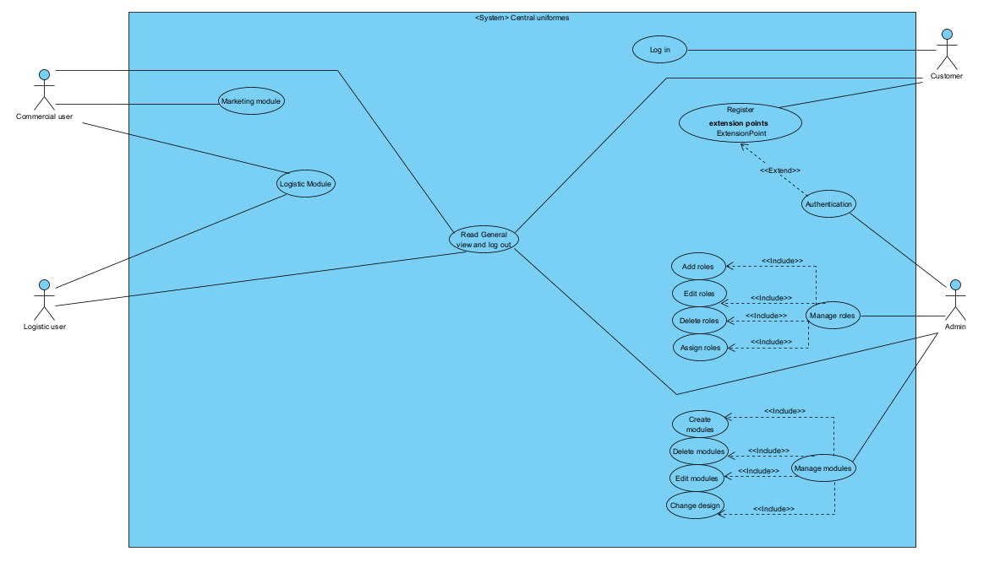

# Use Case Diagram

# Class Diagram

## In this diagram:

- The main classes are User, Role, and Application.
- The many-to-many relationship between User and Role is represented by the Roles_to_Users class, which acts as an intermediate table.
- The one-to-many relationship between Role and Application is represented by an arrow indicating the direction of the relationship.

# Entity-Relationship Model

This repository contains the description of the entity-relationship model for a database managing users, roles, and applications.

## Table "users"

### Description
The "users" table stores information about the system's users.

### Fields
- **id**: Unique identifier for each user.
- **name**: User's name.
- **email**: User's email address.
- **password**: User's password.

## Table "roles"

### Description
The "roles" table maintains information about the roles available in the system.

### Fields
- **id**: Unique identifier for each role.
- **name**: Role name.

## Table "roles_to_users" (Intermediate Table)

### Description
The intermediate table "roles_to_users" establishes a many-to-many relationship between users and roles.

### Fields
- **user_id**: Foreign key referencing the user.
- **role_id**: Foreign key referencing the role.

## Table "applications"

### Description
The "applications" table represents the applications available in the system.

### Fields
- **id**: Unique identifier for each application.
- **name**: Application name.

## Relationships

- The "users" table has a many-to-many relationship with the "roles" table through the intermediate table "roles_to_users."
- The "applications" table has a one-to-many relationship with the "roles" table.

## Entity-Relationship Diagram
Including a visual diagram representing the relationships between tables will aid in understanding the model.

<<<<<<< HEAD
=======
---

>>>>>>> a83912859582c1f1973285826ab010414d89d2e9
# Differences between Types of Mobile Applications

## Native Applications

- **Definition:** Native applications are specifically developed for a particular platform using the native language of that platform.
- **Advantages:**
  - Fast and smooth performance.
  - Full access to the device's hardware.
- **Disadvantages:**
  - Development costs and time.
  - Distribution through app stores.

## Web Applications

- **Definition:** Accessible through a web browser and do not require installation on the device.
- **Advantages:**
  - Cross-platform, running on any device with a browser.
  - No installation required, and they update automatically.
- **Disadvantages:**
  - Limited access to hardware.
  - Performance may be inferior to native applications.

## Hybrid Applications

- **Definition:** Use web technologies and are wrapped in a native container to run on multiple platforms.
- **Advantages:**
  - Faster development with a shared codebase.
  - Distribution through app stores.
- **Disadvantages:**
  - Performance may be inferior.
  - Limited access to hardware.

## Progressive Web Apps (PWAs)

- **Definition:** Web applications with functionalities similar to native applications.
- **Advantages:**
  - Optional installation on the home screen.
  - Offline functionality.
- **Disadvantages:**
  - Limited access to hardware.
  - Experience may vary depending on the browser.

