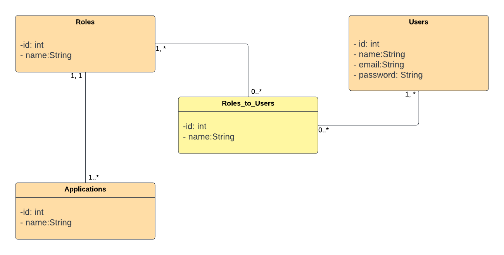
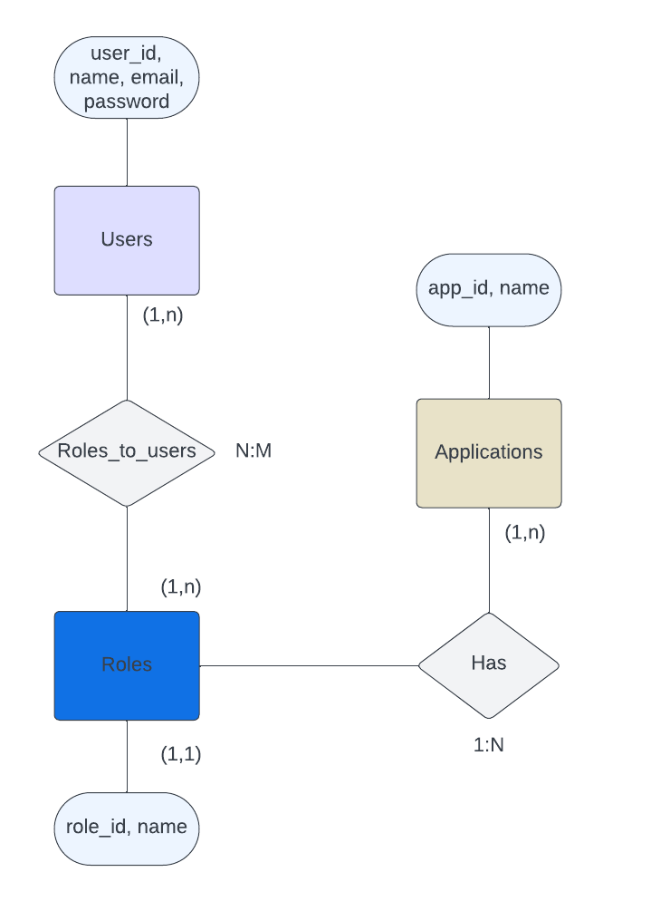
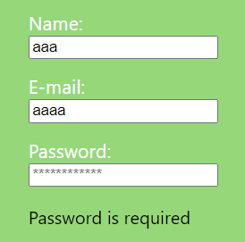

# Central de Uniformes

## Introduction

Welcome to the Intranet for Central de Uniformes! This platform is designed to address the increasing complexity of resource and access management in the workplace. Tailored for the Central de Uniformes company, dedicated to uniform manufacturing and distribution, this intranet aims to streamline daily challenges in handling internal users, roles, and applications. The primary goal is to optimize access control and responsibility assignment, providing a comprehensive solution for resource administration and operational efficiency improvement.

## Business Context

Specifically crafted for the dynamic and diverse environment of Central de Uniformes, this intranet ensures effective management of users, roles, and applications. It is indispensable for maintaining a seamless workflow and fostering effective collaboration across various departments. Users enjoy controlled access to relevant applications, ensuring each team member can perform their functions optimally.

## Development Highlights

The Intranet empowers company administrators to centrally create and manage users, roles, and applications. Administrators have the flexibility to assign roles, controlling access privileges. Users can access designated applications based on their roles, facilitating a personalized and efficient user experience. Additionally, the platform provides features such as viewing the "Home" and managing user profiles, contributing to a more productive and collaborative work environment within Central de Uniformes.

---

# Use Case Diagram


# Class Diagram



## In this diagram:

- The main classes are User, Role, and Application.
- The many-to-many relationship between User and Role is represented by the Roles_to_Users class, which acts as an intermediate table.
- The one-to-many relationship between Role and Application is represented by an arrow indicating the direction of the relationship.

# Entity-Relationship Model

This repository contains the description of the entity-relationship model for a database managing users, roles, and applications.

## Table "users"

### Description

The "users" table stores information about the system's users.

### Fields

- **id**: Unique identifier for each user.
- **name**: User's name.
- **email**: User's email address.
- **password**: User's password.

## Table "roles"

### Description

The "roles" table maintains information about the roles available in the system.

### Fields

- **id**: Unique identifier for each role.
- **name**: Role name.

## Table "roles_to_users" (Intermediate Table)

### Description

The intermediate table "roles_to_users" establishes a many-to-many relationship between users and roles.

### Fields

- **user_id**: Foreign key referencing the user.
- **role_id**: Foreign key referencing the role.

## Table "applications"

### Description

The "applications" table represents the applications available in the system.

### Fields

- **id**: Unique identifier for each application.
- **name**: Application name.

## Relationships

- The "users" table has a many-to-many relationship with the "roles" table through the intermediate table "roles_to_users."
- The "applications" table has a one-to-many relationship with the "roles" table.

## Entity-Relationship Diagram

Including a visual diagram representing the relationships between tables will aid in understanding the model.



---

# Usability: List of Considerations

## Forms and Validations:

- **Justification:** Form validation has been implemented to ensure that entered data is correct and complete. This enhances the user experience by providing immediate feedback on potential errors and prevents the submission of incorrect data.


  
- **Considerations:** Fields such as name, email, and password are validated. Specific and clear error messages are displayed for each field.

## Action Feedback:

- **Justification:** Visual and text feedback is provided to inform the user about the outcome of their actions, such as submitting a form or performing an update. This helps users understand the application's state and confirm the success of their actions.
  
- **Considerations:** Success and error messages are used for user creation and update operations.


## Intuitive Navigation:

- **Justification:** The interface is logically organized, and a side navigation bar is provided for easy access to different sections of the application. Intuitive navigation improves efficiency and user satisfaction.
  
- **Considerations:** A navigation bar with clear and descriptive links is used. Section organization follows a logical flow.

## Success and Error Messages:

- **Justification:** Success and error messages are essential to inform the user about the outcome of their actions. This helps reduce uncertainty and improves user confidence in the application.

- **Considerations:** Success and error messages are displayed contextually for operations such as login, user creation, and updates.

## Usability and Accessibility Study Process:

### Preliminary Research:

- Research was conducted on best practices in user interface design, focusing on usability and accessibility.
  
- Requirements and specific guidelines related to user experience and web accessibility were identified.

### User Testing and Feedback:

- User testing was conducted with a representative group to evaluate the interface and gather feedback on usability.
  
- Feedback was collected to adjust the interface and address any identified issues.

### Accessibility Guidelines Review:

- WCAG accessibility guidelines were reviewed to ensure compliance with established standards.
  
- Design practices and features that enhance accessibility for users with disabilities were implemented.

### Iteration and Continuous Improvement:

- The development process was iterative, with regular reviews to address usability and accessibility issues.
  
- Continuous improvement was prioritized through user feedback and the application of inclusive design practices.

By following this approach, the goal is to ensure a positive and accessible user experience for a diverse audience, promoting usability and accessibility in all aspects of the design and development of the application.


---

# Laravel with React

## Developer Installation Guide

### Server Installation

1. Clone the repository:`git clone`
2. Navigate to the server directory: `cd backend`
3. Install dependencies: `composer install`
4. Set up the database: `php artisan migrate`
5. Seed the database (optional): `php artisan db:seed`
6. Install Passport for authentication: `php artisan passport:install`
7. Configure the `.env` file with your database and Passport credentials.
8. Start the Laravel server: `php artisan serve`

### Client Installation

1. Navigate to the client directory: `cd frontend`
2. Install dependencies: `npm install`
3. Configure environment variables in `.env` or `.env.local` files.
4. Start the React development server:

```sh
npm start
```

## Technical Installation Guide

1. Follow the Developer Installation Guide to set up the server and client.
2. Configure the server to run on a production environment.
3. Configure your web server (e.g., Apache or Nginx) to serve the Laravel application.
4. Build the React application: 
```sh
npm run build
```
5. Point your web server to the build directory for the React application.

## User Manual

### Installation for Users

1. Visit the provided URL or download the application.
2. Follow the on-screen instructions for installation.

### App Guidance

1. **Authentication:** Log in using your credentials.
2. **Navigation:** Explore different sections using the menu.
3. **Profile:** Manage your profile settings.
4. **Access Control:** Users with admin roles can manage users, roles, and applications.
5. **Home:** View personalized home content.
6. **Logout:** Safely log out from your account.

## In-App User Assistance

The application includes an accessible user help section where you can find detailed guides and FAQs to assist you in using various features effectively.

---

## Technology Stack

### Backend (Laravel with Passport)

- **Laravel:** PHP web development framework.
- **Passport:** Laravel library for API authentication using OAuth2.

### Frontend (React)

- **React:** JavaScript library for building user interfaces.
- **Axios:** HTTP client for making requests to the backend API.
- **React Router Dom:** Router for managing navigation in the React application.
- **Ant Design:** UI component library for React.
- **React Icons:** Icon library for React.
- **Antd Icons:** Additional icons for Ant Design.

This technology stack combines the strengths of Laravel on the server-side with React on the client-side, leveraging Passport for secure authentication. Additionally, Axios is used for HTTP communication, and various design and styling libraries such as Ant Design, React Router Dom, React Icons, and Antd Icons enhance the user interface and user experience.

If you need additional information or clarification, I'll be happy to assist.

---

# Differences between Types of Mobile Applications

## Native Applications

- **Definition:** Native applications are specifically developed for a particular platform using the native language of that platform.
- **Advantages:**
  - Fast and smooth performance.
  - Full access to the device's hardware.
- **Disadvantages:**
  - Development costs and time.
  - Distribution through app stores.

## Web Applications

- **Definition:** Accessible through a web browser and do not require installation on the device.
- **Advantages:**
  - Cross-platform, running on any device with a browser.
  - No installation required, and they update automatically.
- **Disadvantages:**
  - Limited access to hardware.
  - Performance may be inferior to native applications.

## Hybrid Applications

- **Definition:** Use web technologies and are wrapped in a native container to run on multiple platforms.
- **Advantages:**
  - Faster development with a shared codebase.
  - Distribution through app stores.
- **Disadvantages:**
  - Performance may be inferior.
  - Limited access to hardware.

## Progressive Web Apps (PWAs)

- **Definition:** Web applications with functionalities similar to native applications.
- **Advantages:**
  - Optional installation on the home screen.
  - Offline functionality.
- **Disadvantages:**
  - Limited access to hardware.
  - Experience may vary depending on the browser.

---

## Repositories

- **Github:** [Link to Github Project](https://github.com/Davidps97/uniform-project/tree/master)
- **Figma:** [Link to Figma](https://www.figma.com/file/Kmz4aoXHtmLPvcpIl6bG4c/Untitled?type=design&node-id=0%3A1&mode=design&t=a7kmjdrAJjbSiVG4-1)

## Planning

## Conclusions, Opinions, Reflections

This project was an enriching and challenging experience. I learned to seamlessly integrate Laravel and React, leveraging tools like Passport for authentication. The choice of libraries such as Ant Design facilitated the development of an attractive and functional interface. The insights gained into user and role management improved our understanding of security and efficiency in the workplace.

It is crucial to emphasize that the reflections expressed here are authentic and not included merely to fulfill content requirements.

## Links and References

- [Laravel Documentation](https://laravel.com/docs)
- [React Documentation](https://reactjs.org/docs)
- [Passport Documentation](https://laravel.com/docs/passport)
- [Ant Design Documentation](https://ant.design/docs/react/introduce)
- [React Router Dom Documentation](https://reactrouter.com/web/guides/quick-start)
- [Axios Documentation](https://axios-http.com/docs/intro)
- [GitHub](https://github.com/)
